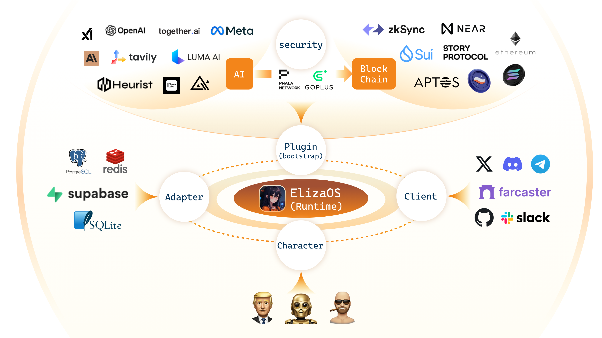

<<<<<<< HEAD
# Eliza 🤖

<div align="center">
  
</div>

<div align="center">

📑 [Technical Report](https://arxiv.org/pdf/2501.06781) |  📖 [Documentation](https://elizaos.github.io/eliza/) | 🎯 [Examples](https://github.com/thejoven/awesome-eliza)

</div>

## 🌍 README Translations

[中文说明](i18n/readme/README_CN.md) | [日本語の説明](i18n/readme/README_JA.md) | [한국어 설명](i18n/readme/README_KOR.md) | [Persian](i18n/readme/README_FA.md) | [Français](i18n/readme/README_FR.md) | [Português](i18n/readme/README_PTBR.md) | [Türkçe](i18n/readme/README_TR.md) | [Русский](i18n/readme/README_RU.md) | [Español](i18n/readme/README_ES.md) | [Italiano](i18n/readme/README_IT.md) | [ไทย](i18n/readme/README_TH.md) | [Deutsch](i18n/readme/README_DE.md) | [Tiếng Việt](i18n/readme/README_VI.md) | [עִברִית](i18n/readme/README_HE.md) | [Tagalog](i18n/readme/README_TG.md) | [Polski](i18n/readme/README_PL.md) | [Arabic](i18n/readme/README_AR.md) | [Hungarian](i18n/readme/README_HU.md) | [Srpski](i18n/readme/README_RS.md) | [Română](i18n/readme/README_RO.md) | [Nederlands](i18n/readme/README_NL.md) | [Ελληνικά](i18n/readme/README_GR.md)

## 🚩 Overview

<div align="center">
  
</div>

## ✨ Features

- 🛠️ Full-featured Discord, X (Twitter) and Telegram connectors
- 🔗 Support for every model (Llama, Grok, OpenAI, Anthropic, Gemini, etc.)
- 👥 Multi-agent and room support
- 📚 Easily ingest and interact with your documents
- 💾 Retrievable memory and document store
- 🚀 Highly extensible - create your own actions and clients
- 📦 Just works!

## Video Tutorials

[AI Agent Dev School](https://www.youtube.com/watch?v=ArptLpQiKfI&list=PLx5pnFXdPTRzWla0RaOxALTSTnVq53fKL)

## 🎯 Use Cases

- 🤖 Chatbots
- 🕵️ Autonomous Agents
- 📈 Business Process Handling
- 🎮 Video Game NPCs
- 🧠 Trading

## 🚀 Quick Start

### Prerequisites

- [Python 2.7+](https://www.python.org/downloads/)
- [Node.js 23+](https://docs.npmjs.com/downloading-and-installing-node-js-and-npm)
- [pnpm](https://pnpm.io/installation)

> **Note for Windows Users:** [WSL 2](https://learn.microsoft.com/en-us/windows/wsl/install-manual) is required.

### Use the Starter (Recommended for Agent Creation)

Full steps and documentation can be found in the [Eliza Starter Repository](https://github.com/elizaOS/eliza-starter).
```bash
git clone https://github.com/elizaos/eliza-starter.git
cd eliza-starter
cp .env.example .env
pnpm i && pnpm build && pnpm start
```

### Manually Start Eliza (Only recommended for plugin or platform development)

#### Checkout the latest release

```bash
# Clone the repository
git clone https://github.com/elizaos/eliza.git

# This project iterates fast, so we recommend checking out the latest release
git checkout $(git describe --tags --abbrev=0)
# If the above doesn't checkout the latest release, this should work:
# git checkout $(git describe --tags `git rev-list --tags --max-count=1`)
```

If you would like the sample character files too, then run this:
```bash
# Download characters submodule from the character repos
git submodule update --init
```

#### Edit the .env file

Copy .env.example to .env and fill in the appropriate values.

```
cp .env.example .env
```

Note: .env is optional. If you're planning to run multiple distinct agents, you can pass secrets through the character JSON

#### Start Eliza

```bash
pnpm i
pnpm build
pnpm start

# The project iterates fast, sometimes you need to clean the project if you are coming back to the project
pnpm clean
```

### Interact via Browser

Once the agent is running, you should see the message to run "pnpm start:client" at the end.

Open another terminal, move to the same directory, run the command below, then follow the URL to chat with your agent.

```bash
pnpm start:client
```

Then read the [Documentation](https://elizaos.github.io/eliza/) to learn how to customize your Eliza.

---

### Automatically Start Eliza

The start script provides an automated way to set up and run Eliza:

```bash
sh scripts/start.sh
```

For detailed instructions on using the start script, including character management and troubleshooting, see our [Start Script Guide](./docs/docs/guides/start-script.md).

> **Note**: The start script handles all dependencies, environment setup, and character management automatically.

---

### Modify Character

1. Open `packages/core/src/defaultCharacter.ts` to modify the default character. Uncomment and edit.

2. To load custom characters:
    - Use `pnpm start --characters="path/to/your/character.json"`
    - Multiple character files can be loaded simultaneously
3. Connect with X (Twitter)
    - change `"clients": []` to `"clients": ["twitter"]` in the character file to connect with X

---

### Add more plugins

1. run `npx elizaos plugins list` to get a list of available plugins or visit https://elizaos.github.io/registry/

2. run `npx elizaos plugins add @elizaos-plugins/plugin-NAME` to install the plugin into your instance

#### Additional Requirements

You may need to install Sharp. If you see an error when starting up, try installing it with the following command:

```
pnpm install --include=optional sharp
```

---

## Using Your Custom Plugins
Plugins that are not in the official registry for ElizaOS can be used as well. Here's how:

### Installation

1. Upload the custom plugin to the packages folder:

```
packages/
├─plugin-example/
├── package.json
├── tsconfig.json
├── src/
│   ├── index.ts        # Main plugin entry
│   ├── actions/        # Custom actions
│   ├── providers/      # Data providers
│   ├── types.ts        # Type definitions
│   └── environment.ts  # Configuration
├── README.md
└── LICENSE
```

2. Add the custom plugin to your project's dependencies in the agent's package.json:

```json
{
  "dependencies": {
    "@elizaos/plugin-example": "workspace:*"
  }
}
```

3. Import the custom plugin to your agent's character.json

```json
  "plugins": [
    "@elizaos/plugin-example",
  ],
```

---

### Start Eliza with Gitpod

[](https://gitpod.io/#https://github.com/elizaos/eliza/tree/main)

---

### Deploy Eliza in one click

Use [Fleek](https://fleek.xyz/eliza/) to deploy Eliza in one click. This opens Eliza to non-developers and provides the following options to build your agent:
1. Start with a template
2. Build characterfile from scratch
3. Upload pre-made characterfile

Click [here](https://fleek.xyz/eliza/) to get started!

---

### Community & contact

- [GitHub Issues](https://github.com/elizaos/eliza/issues). Best for: bugs you encounter using Eliza, and feature proposals.
- [elizaOS Discord](https://discord.gg/elizaos). Best for: hanging out with the elizaOS technical community
- [DAO Discord](https://discord.gg/ai16z). Best for: hanging out with the larger non-technical community

## Citation

We now have a [paper](https://arxiv.org/pdf/2501.06781) you can cite for the Eliza OS:
```bibtex
@article{walters2025eliza,
  title={Eliza: A Web3 friendly AI Agent Operating System},
  author={Walters, Shaw and Gao, Sam and Nerd, Shakker and Da, Feng and Williams, Warren and Meng, Ting-Chien and Han, Hunter and He, Frank and Zhang, Allen and Wu, Ming and others},
  journal={arXiv preprint arXiv:2501.06781},
  year={2025}
}
```

## Contributors

<a href="https://github.com/elizaos/eliza/graphs/contributors">
  
</a>


## Star History

[](https://star-history.com/#elizaos/eliza&Date)

## 🛠️ System Requirements

### Minimum Requirements
- CPU: Dual-core processor
- RAM: 4GB
- Storage: 1GB free space
- Internet connection: Broadband (1 Mbps+)

### Software Requirements
- Python 2.7+ (3.8+ recommended)
- Node.js 23+
- pnpm
- Git

### Optional Requirements
- GPU: For running local LLM models
- Additional storage: For document storage and memory
- Higher RAM: For running multiple agents

## 📁 Project Structure
```
eliza/
├── packages/
│   ├── core/           # Core Eliza functionality
│   ├── clients/        # Client implementations
│   └── actions/        # Custom actions
├── docs/              # Documentation
├── scripts/           # Utility scripts
└── examples/          # Example implementations
```

## 🤝 Contributing

We welcome contributions! Here's how you can help:

### Getting Started
1. Fork the repository
2. Create a new branch: `git checkout -b feature/your-feature-name`
3. Make your changes
4. Run tests: `pnpm test`
5. Submit a pull request

### Types of Contributions
- 🐛 Bug fixes
- ✨ New features
- 📚 Documentation improvements
- 🌍 Translations
- 🧪 Test improvements

### Code Style
- Follow the existing code style
- Add comments for complex logic
- Update documentation for changes
- Add tests for new features
=======
# SC6109

## Option 1. AI-Powered On-Chain Agent Protocol with Intent Infrastructure

Ref: [elizaOS](https://eliza.how/)

### Project Summary

Design and develop an on-chain protocol for autonomous AI agents that can initiate and execute transactions based on user intent. The system should allow users to deploy and interact with agents using smart contracts that integrate with decentralized intent relayers.

### Background & Problem Statement

Autonomous agents represent a new frontier in blockchain-based automation. However, on-chain execution is still limited by infrastructure that lacks native support for asynchronous, multi-step intents. This project explores how to build a scalable framework for on-chain agents with high transaction throughput and secure, programmable interactions.

### Feature Requirements

- Smart contract architecture for deploying and managing AI agents.
- Intent encoding interface (e.g., order creation or batch execution).
- Integration with intent-based infrastructure like Anoma, CowSwap, or dappOS.
- Support for on-chain oracles or LLM inference (mock or off-chain relay).
- UX for submitting, managing, and visualizing agent activity.

### Hints & Directions

- Explore Ethereum Account Abstraction (ERC-4337) and recent intent protocols.
- Consider use cases such as on-chain trading agents, NFT sweepers, or restaking optimizers.
- Examine cross-chain or multi-intent relayer support for scalability

## Option 2. Choose your own proposal from [Gitcoin](https://grants.gitcoin.co/)

核心组件
- Agent Manager Contract
- Intent Encoder/Decoder (order creation or batch execution)
- Intent Relayer/Solver
    - Anoma: 原生支持意图表达与撮合，允许开发者用意图而非交易描述应用逻辑。
    - CoW Swap: 通过“意图”签名消息，委托 solver 优化执行路径，用户体验极佳。
    - dappOS: 
    - ERC-4337: 账户抽象, 允许用智能合约钱包和自定义验证逻辑，极大提升可编程性和安全性
- AI/LLM 推理服务（可先用 mock/off-chain relay）
    - elizaOS：提供智能体运行时、插件生态、任务调度、上下文管理等能力，适合参考其 agent 结构与插件机制
    - Warden Protocol、Artela、ICP：支持链上 AI agent 的完整生命周期管理、链上推理、跨链操作等
    - AI Oracle：通过 oracle 将链下 AI 结果安全写入链上，保证数据可验证性
- Dashboard/UX

graph TD
A[用户] -->|提交意图| B[前端/Intent Encoder]
B -->|签名意图| C[Intent Relayer]
C -->|解码&分发| D[智能体管理合约]
D -->|调用| E[AI Agent]
E -->|链上操作| F[目标合约/DeFi协议]
E -->|需要AI推理| G[AI Oracle/LLM服务]

分步开发路线
第一阶段：最小可用产品（MVP）
1. 设计并部署基本的 Agent 管理智能合约，支持注册/管理智能体。
2. 实现意图编码接口（如 JSON schema），支持简单的 order creation 或 batch execution。
3. 集成 ERC-4337 智能合约钱包，实现自定义验证和 gas 代付（paymaster）。
4. 搭建前端原型，支持用户提交意图和查看 agent 状态。
5. AI 推理部分可用 mock API 实现，后续可升级为链下 LLM 服务或 oracle。
第二阶段：集成意图基础设施
1. 对接 Anoma、CoW Swap、dappOS 等意图 relayer，实现多意图池和 solver 支持。
2. 支持复杂意图（如跨链、批量操作、多步骤任务）。
3. 实现 solver 竞价与最优路径选择机制。
第三阶段：AI Agent 智能化与隐私扩展
1. 集成链下/链上 LLM 推理服务，提升 agent 智能决策能力。
2. 支持隐私保护（如 TEE、零知识证明等）和多链操作。
3. 丰富前端交互与可视化，支持 agent 活动日志、意图历史等。

技术栈建议
- 智能合约：Solidity（EVM 兼容链），ERC-4337 标准，或 Move/Rust（如 Aptos/Sui/ICP）。
- 前端：React/Vue + ethers.js/web3.js，支持钱包连接与意图签名。
- AI/LLM 服务：Python/Node.js，初期用 OpenAI API，后期可集成去中心化推理网络。
- 中继/solver：Node.js/Go，负责意图收集、解码、分发与执行。
- 数据库：用于 agent 状态、意图历史等（如 PostgreSQL、MongoDB）。

建议的起步步骤
1. 调研并熟悉 elizaOS、ERC-4337、CoW Swap、Anoma 等协议的核心机制与代码示例。
2. 画出整体架构图，明确每个模块的功能与接口。
3. 快速搭建智能合约原型（如 agent manager、intent handler）并在 testnet 上测试。
4. 实现最基础的前端交互和意图提交流程，确保端到端跑通。
5. 逐步丰富 agent 能力与意图类型，探索与 solver、AI oracle 的集成。

测试流程
1. 用户在网页输入意图，点击提交。
2. 前端把意图转成JSON，发给Relayer。
3. Relayer把意图传给智能合约。
4. 智能合约收到意图，记录下来。
5. AI服务（可以是假的）分析意图，返回建议。
6. 智能合约根据AI建议，模拟执行操作。
7. 前端显示执行结果。
>>>>>>> 627e3f6a4b0737a5116561e7d775f61573ba3ee9
